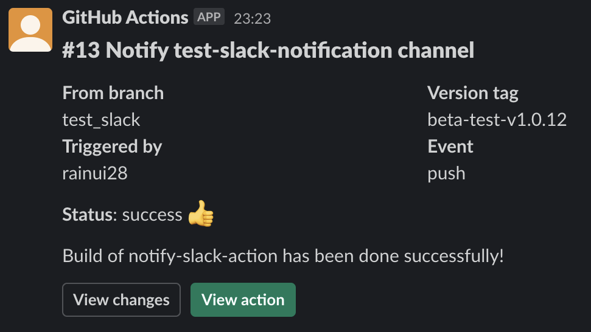
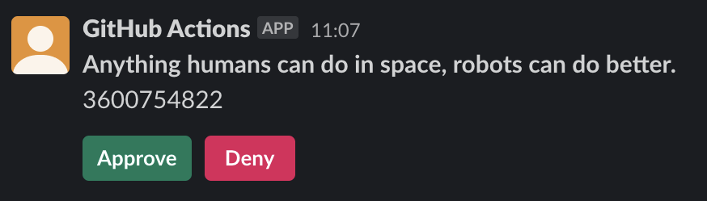

# :zap: Notify Slack Action

_Forked from [abinoda/slack-action](https://github.com/abinoda/slack-action)_

:nail_care: Send **fancy** message to a Slack channel, group or DM using [Slack bot tokens](https://api.slack.com/docs/token-types).

**Note**: To use this GitHub Action you'll first need to create a Slack App and install it to your Slack workspace.

**:rocket: Features**:

- Send **simple text message** to a slack channel
- Send **[blocks message](https://api.slack.com/block-kit)** to a slack channel
- Send **message based from templates** available [here](https://github.com/evryfs/notify-slack-action/tree/templates)

## :information_source: Parameters

**Parameters described below are matching the latest version tag.**
You can find available action's tags [here](https://github.com/evryfs/notify-slack-action/tags)

| **Parameter**   | **Required** | **Type** | **Description**                                                                      |
| --------------- | ------------ | -------- | ------------------------------------------------------------------------------------ |
| SLACK_BOT_TOKEN | x            | secret   | Slack bot token auth                                                                 |
| channel-id      | x            | string   | Channel where message will be posted                                                 |
| value           | x            | string   | Value depending on the mechanism chosen. Details below                               |
| mechanism       | x            | string   | Mechanism to use when notify a slack channel. Either 'text', 'blocks' or 'templates' |

## :octocat: Usage

```yaml
- name: Notify Slack
  env:
    SLACK_BOT_TOKEN: ${{ secrets.SLACK_BOT_TOKEN }} # required
  uses: evryfs/notify-slack-action@<tag>
  with:
    channel-id: <slack-channel-id> # required
    value: <text-to-post> # required
    mechanism: <mechanism> # optional. Defaults to 'text'
```

### Using `text` mechanism

```yaml
- name: Notify Slack using text
  env:
    SLACK_BOT_TOKEN: ${{ secrets.SLACK_BOT_TOKEN }} # required
  uses: evryfs/notify-slack-action@latest
  with:
    channel-id: C04DFAHCTS5
    mechanism: text
    value: Hello GitHub Action!
```

Slack message would looks like:


### Using `templates` mechanism

Templates mechanism are pre-defined blocks messages that contains (valuable) generics information. They are defined in a **orphan branch** named [`templates`](https://github.com/evryfs/notify-slack-action/tree/templates). Templates can be added by creating a pull request to this branch. More information [here](https://github.com/evryfs/notify-slack-action/blob/templates/README.md).

#### Override template variable

Templates are using environments variables to generate information, that are called **templates variables**.

For instance, [gh_dashboard_simple.json](https://github.com/evryfs/notify-slack-action/blob/templates/templates/gh_dashboard_simple.json) contains template variable `$VERSION_TAG`, `$ACTION_STATUS` or even `$GITHUB_REF_NAME`. Those variables are intended to be override either by the system (ie. github runner envs) or by the developer using `env:` at the workflow/job/step level.

```yaml
- name: Notify Slack using templates
  env:
    SLACK_BOT_TOKEN: ${{ secrets.SLACK_BOT_TOKEN }} # required
    VERSION_TAG: ${{ inputs.version-tag }} # NOTE github context can be used to retrieve inputs/outputs/context
    ACTION_STATUS: "success :thumbsup:" # NOTE Slack 'mrkdwn' format is supported
    TEXT_MESSAGE: "Build of notify-slack-action has been done successfully!" # Override the template variable $VERSION_TAG
  uses: evryfs/notify-slack-action@latest
  with:
    channel-id: C04DFAHCTS5
    mechanism: templates
    value: gh_dashboard_simple.json # Load template gh_dhasboard_simple.json
```

By loading the [gh_dashboard_simple.json](https://github.com/evryfs/notify-slack-action/blob/templates/templates/gh_dashboard_simple.json) template, Slack message would looks like:



**Note:** templates variables depend of the selected template. A template might not have any template variable. You must take a look at the template's guideline (or source code).

### Using `blocks` mechanism

It is possible to personnalise a message by using Slack Block Kit without submitting a template to `evryfs/notify-slack-action`. You can use [Slack Block Kit Builder](https://api.slack.com/block-kit/building) to easily construct a message layout and generate its JSON code.

**Value must be an JSON array!**

```yaml
- name: Notify Slack using blocks
  env:
    SLACK_BOT_TOKEN: ${{ secrets.SLACK_BOT_TOKEN }} # required
    VERSION_TAG: ${{ inputs.version-tag }} # NOTE github context can be used to retrieve inputs/outputs/context
    ACTION_STATUS: "success :thumbsup:" # NOTE Slack 'mrkdwn' format is supported
    TEXT_MESSAGE: "Build of notify-slack-action has been done successfully!" # Override the template variable $VERSION_TAG
  uses: evryfs/notify-slack-action@latest
  with:
    channel-id: C04DFAHCTS5
    mechanism: blocks
    value: | # Make sure to use | in order to parse JSON text
      [
        {
          "type": "section",
          "text": {
            "type": "mrkdwn",
            "text": "*Anything humans can do in space, robots can do better.*\n${{ github.run_id }}"
          }
        },
        {
          "type": "actions",
          "elements": [
            {
              "type": "button",
              "text": {
                "type": "plain_text",
                "emoji": true,
                "text": "Approve"
              },
              "style": "primary",
              "value": "yes"
            },
            {
              "type": "button",
              "text": {
                "type": "plain_text",
                "emoji": true,
                "text": "Deny"
              },
              "style": "danger",
              "value": "no"
            }
          ]
        }
      ]
```

Slack message would looks like:



## :book: References

- [Templates mechanism guideline](https://github.com/evryfs/notify-slack-action/blob/templates/README.md)
- [Slack's documentation](https://api.slack.com/docs/messages)
- [Slack's API Bot](https://api.slack.com/authentication/basics)
- [Slack chat.postMessage](https://api.slack.com/methods/chat.postMessage)

**Note**: A "channel ID" can be the ID of a channel, private group, or user you would like to post a message to. Your bot can message any user in your Slack workspace but needs to be invited into channels and private groups before it can post to them.

- **Slack App**: Right click on channel > View channel details > Channel ID (at the bottom)
- **Slack Webapp**: channel IDs at the end of the URL when viewing channels and private groups. Note that this doesn't work for direct messages. `https://myworkspace.slack.com/messages/CHANNEL_ID/`

## :memo: License

The associated scripts and documentation in this project are released under the [MIT License](LICENSE).
