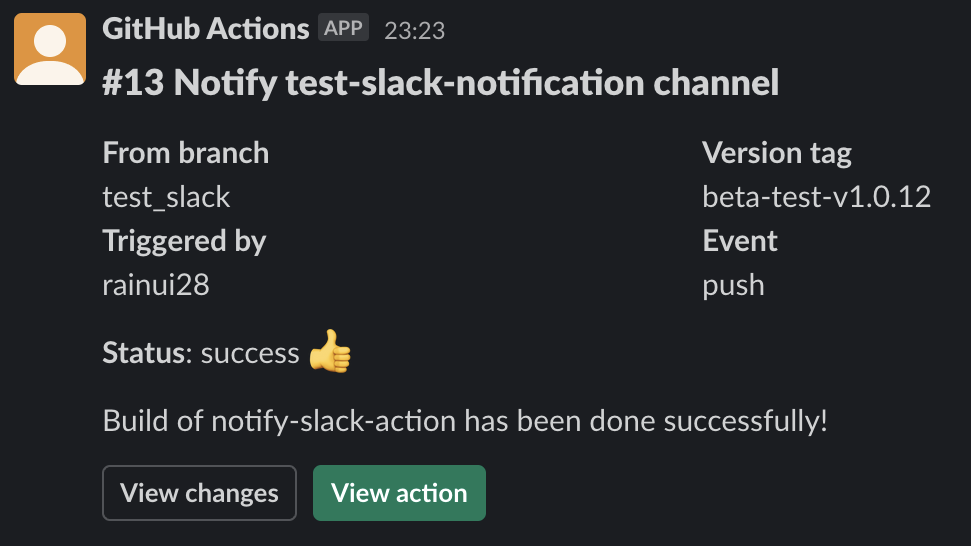

# Guideline

| Name                                                           | Type   | Designed for action-type     |
| -------------------------------------------------------------- | ------ | ---------------------------- |
| [gh_dashboard_simple.json](templates/gh_dashboard_simple.json) | blocks | `build`, `deploy`, `general` |

## Template preview

## Template variables

- `ACTION_STATUS`: shows the result of an action on Slack
- `VERSION_TAG`: shows the version tag if there is one. Useful when an action's purpose is to `build` or `deploy`
- `TEXT_MESSAGE`: write a custom message to specify the goal of this notification

_Note:_ This template includes github context envs that start with `$GITHUB_`

## Templates actions

- `View changes`: button that shows the changes from the last commit of the triggered branch on github.com
- `View action`: button that opens the action's summary on github.com